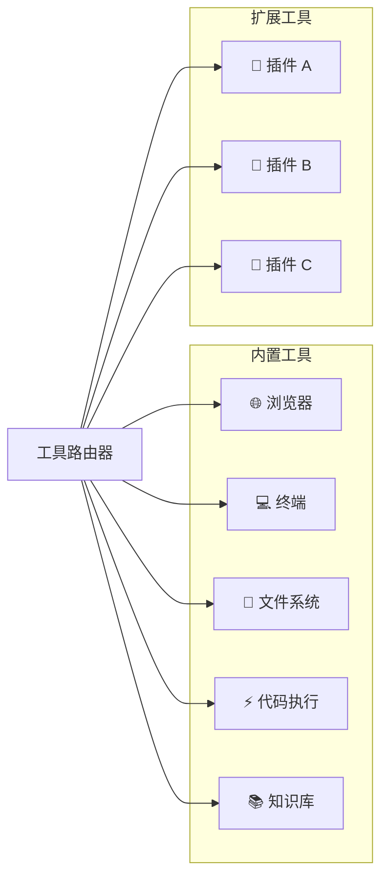
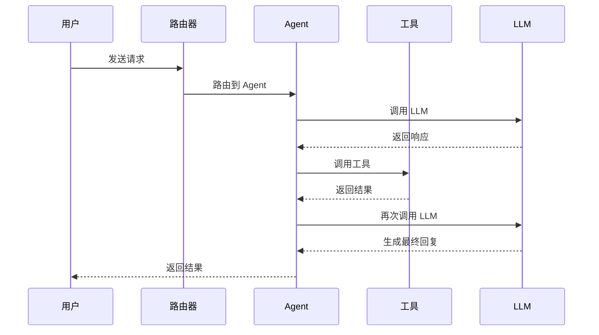

# 架构设计

## 整体架构

Agent Harness 采用分层架构设计，自底向上分为四层，各层职责清晰、解耦良好。

```mermaid
graph TB
    subgraph 用户接口层
        CLI[CLI 终端]
        REST[REST API]
        WEB[Web UI]
        SDK[Python SDK]
    end

    subgraph Agent 编排层
        SM[会话管理]
        TR[工具路由]
        CTX[上下文维护]
        MEM[记忆系统]
    end

    subgraph 工具执行层
        BR[浏览器自动化]
        TERM[终端执行]
        FS[文件系统]
        CODE[代码执行]
        KB[知识库]
    end

    subgraph LLM 适配层
        OA[OpenAI]
        CL[Claude]
        DS[DeepSeek]
        LOCAL[本地模型]
    end

    用户接口层 --> Agent 编排层
    Agent 编排层 --> 工具执行层
    Agent 编排层 --> LLM 适配层
```

## 层级详解

### 1. 用户接口层

负责接收用户输入并返回 Agent 输出，支持多种接入方式：

| 接口 | 说明 | 适用场景 |
|------|------|----------|
| CLI 终端 | 命令行交互界面 | 开发调试、快速测试 |
| REST API | HTTP JSON 接口 | 系统集成、远程调用 |
| Web UI | 浏览器可视化界面 | 日常使用、演示展示 |
| Python SDK | Python 原生调用 | 二次开发、自动化脚本 |

### 2. Agent 编排层

核心调度层，负责 Agent 的生命周期管理：

**会话管理（Session Manager）**
- 维护用户会话状态
- 管理对话历史
- 支持长连接和断线重连

**工具路由（Tool Router）**
- 根据用户意图自动选择合适的工具
- 支持工具热插拔
- 工具调用权限控制

**上下文维护（Context Manager）**
- 维护 Agent 的短期记忆
- 管理 Token 窗口
- 上下文压缩与摘要

**记忆系统（Memory System）**
- 长期记忆持久化
- 基于 RAG 的知识检索
- 跨会话信息关联

### 3. 工具执行层

Agent 可调用的工具集合，采用插件化架构：



### 4. LLM 适配层

统一的大语言模型接入层，提供一致的接口抽象：

```python
# 适配器接口示例
class LLMAdapter:
    async def chat(self, messages: list[dict]) -> str:
        """发送聊天请求并返回回复"""
        pass

    async def stream_chat(self, messages: list[dict]) -> AsyncIterator[str]:
        """流式聊天请求"""
        pass

    def count_tokens(self, text: str) -> int:
        """计算 Token 数量"""
        pass
```

## 核心设计原则

### 1. 插件化工具系统

所有工具通过统一的接口注册，支持动态加载：

```python
@tool.register(name="web_search", description="搜索互联网信息")
async def web_search(query: str, max_results: int = 5) -> list[dict]:
    """搜索互联网并返回结果"""
    ...
```

### 2. 事件驱动架构

系统内部通过事件总线通信，支持异步非阻塞处理：



### 3. 安全沙箱

工具执行在受限的沙箱环境中，确保系统安全：

- 文件系统访问受限
- 网络请求可审计
- 代码执行隔离
- 资源使用配额

## 数据流

```
用户输入
    │
    ▼
┌─────────────┐     ┌─────────────┐
│ 输入解析器   │────▶│ 意图识别    │
└─────────────┘     └──────┬──────┘
                           │
              ┌────────────┼────────────┐
              ▼            ▼            ▼
        ┌──────────┐ ┌──────────┐ ┌──────────┐
        │ 对话回复  │ │ 工具调用  │ │ 知识检索  │
        └──────────┘ └──────────┘ └──────────┘
              │            │            │
              └────────────┼────────────┘
                           ▼
                    ┌─────────────┐
                    │ 响应生成器   │
                    └──────┬──────┘
                           │
                           ▼
                    用户输出
```

---

> 📖 [上一步：快速开始](quickstart.md) | 📖 [下一步：API 参考 →](api.md)
