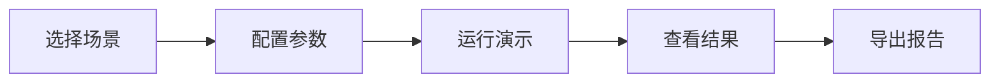

# CS Demo（客户成功演示）

CS Demo 是 Agent Harness 内置的客户成功演示模块，旨在向潜在客户快速展示 Agent Harness 的核心能力与业务价值。

## 概述

CS Demo 提供了一系列预定义的演示场景，覆盖企业常见的 AI 应用场景。通过一键运行这些场景，客户可以在几分钟内直观地感受到 Agent Harness 的强大能力。



## 9 大演示场景

| # | 场景名称 | 说明 | 核心能力展示 |
|---|----------|------|-------------|
| 1 | 🛒 **电商客服** | 模拟电商平台的智能客服对话，处理订单查询、退换货请求 | 对话管理、上下文理解、工具调用 |
| 2 | 💻 **代码审查** | 自动审查 Pull Request 代码，生成审查意见和优化建议 | 代码理解、多文件分析、行内注释 |
| 3 | 📊 **数据分析** | 上传 CSV 后自动生成数据分析和可视化报告 | 代码执行、数据分析、图表生成 |
| 4 | 📝 **文档生成** | 根据需求描述自动生成技术文档和 API 文档 | 内容创作、结构化输出、格式转换 |
| 5 | 🌐 **网页抓取** | 对目标网站进行结构化信息提取和内容摘要 | 浏览器自动化、信息提取、内容总结 |
| 6 | 🔍 **知识问答** | 基于上传的知识库文档进行智能问答 | RAG 检索、语义理解、知识管理 |
| 7 | 📧 **邮件处理** | 自动分类、总结和回复邮件 | 邮件操作、文本分类、自动回复 |
| 8 | 🤝 **多Agent协作** | 多个 Agent 协同完成复杂任务 | Agent 编排、任务分配、结果汇总 |
| 9 | 🧪 **评测对比** | 在标准数据集上对比不同模型和配置的性能 | 评测框架、指标计算、对比报告 |

## 如何运行 CS Demo

### 方式一：通过 CLI 运行

```bash
# 列出所有可用场景
agent-harness cs-demo list

# 运行指定场景
agent-harness cs-demo run --scenario customer-support

# 带参数运行
agent-harness cs-demo run \
  --scenario data-analysis \
  --param file=demo_data.csv \
  --param chart_type=bar
```

### 方式二：通过 Web UI 运行

1. 启动服务：`agent-harness serve`
2. 访问 `http://localhost:8000/cs-demo`
3. 在下拉菜单中选择演示场景
4. 填写必要参数
5. 点击「开始演示」

### 方式三：通过 API 运行

```python
import requests

# 获取场景列表
scenarios = requests.get("http://localhost:8000/cs-demo/scenarios")
print(scenarios.json())

# 运行场景
response = requests.post(
    "http://localhost:8000/cs-demo/run",
    json={
        "scenario_id": "customer-support",
        "params": {
            "customer_name": "某科技公司",
            "industry": "电商"
        }
    }
)
print(response.json())
```

## 自定义演示场景

你可以在 `scenarios/` 目录下创建自定义演示场景：

```python
# scenarios/my_demo.py
from agent_harness import Scenario, register_scenario

@register_scenario(
    id="my-custom-demo",
    name="我的自定义演示",
    description="展示自定义业务场景"
)
class MyCustomDemo(Scenario):
    async def run(self, params: dict):
        # 演示逻辑
        result = await self.agent.run("执行任务...")
        return {"result": result, "duration": "30s"}
```

## 演示报告

每次演示完成后会自动生成演示报告，包含：

- **场景信息**：场景名称和描述
- **执行参数**：本次运行的配置参数
- **执行日志**：详细的步骤执行记录
- **输出结果**：Agent 的完整输出
- **性能指标**：响应时间、Token 消耗等
- **截图记录**：关键步骤的界面截图

---

> 📖 [上一步：API 参考](api.md) | 📖 [下一步：配置说明 →](configuration.md)
